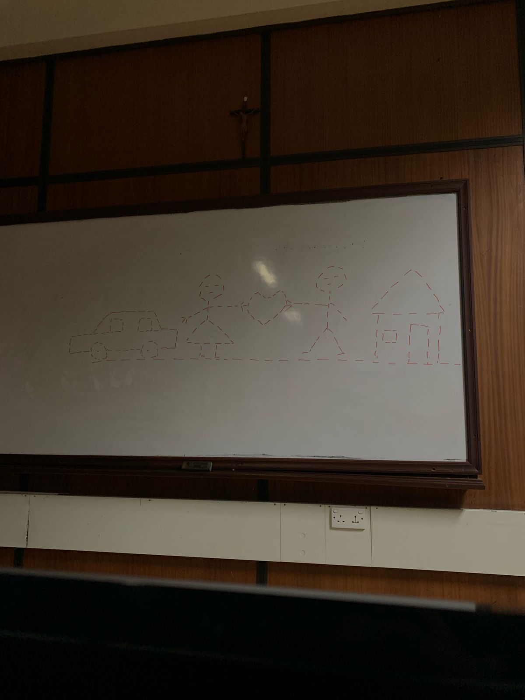

# Problem


# Solution
The [solution](Egide_Family.cpp) uses a single `cout` statement instead of multiple ones by using <b>string concatenation</b>, along with the `\n` escape sequence.

## String Concatenation

In C++, it's possible to <b>concatenate</b> (combine) two or more strings into one by putting them next to each other. The following statement:
```cpp
cout << "Hello, " "world!";     // two strings
```

Is the same as:
```cpp
cout << "Hello, world!";        // one string
```

Both statements produce the same output:
```
Hello, world!
```

When using the <b>concatenated</b> style, we can place each string on its own separate line while still using one `cout`.
The statement:
```cpp
cout << "Good " "morning!";
```

Can also be written as:
```cpp
cout << "Good "
    "morning!";
```

Or even as:
```cpp
cout << 
    "Good "
    "morning!";
```
And both statements produce the same output:
```
Good morning!
```

Note: Placing a string on its own line does not make it appear on a new line with `cout`. For that you can use `\n` in the string itself.

The following three statements:
```cpp
cout << "Good\nafternoon!";
```
```cpp
cout << "Good\n" "afternoon!";
```
```cpp
cout << 
    "Good\n" 
    "afternoon!";
```

All produce the same output:
```
Good
afternoon!
```